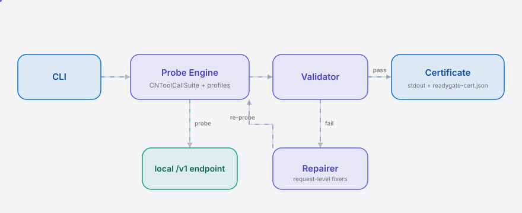
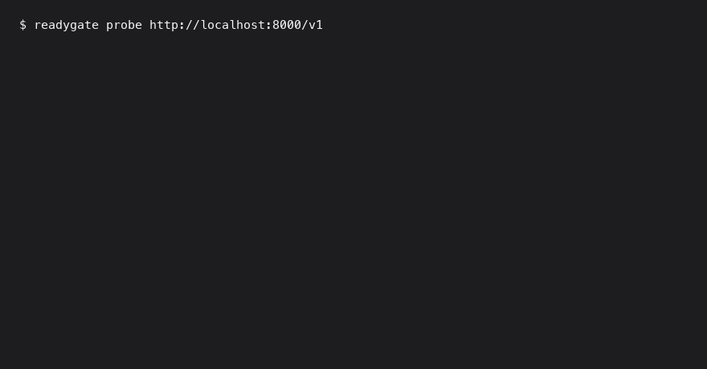

<div align="right"><sub><b>English</b>&nbsp;&nbsp;⇄&nbsp;&nbsp;<a href="./README.md">简体中文</a></sub></div>

<picture>
  <source media="(prefers-color-scheme: dark)" srcset="./assets/hero-dark.svg">
  <source media="(prefers-color-scheme: light)" srcset="./assets/hero-light.svg">
  
</picture>

<p align="center"><sub>A pre-flight agent-readiness gate · one command tells you whether your local Qwen3 / DeepSeek / GLM / Kimi endpoint is actually agent-ready</sub></p>

<p align="center">
  <a href="./LICENSE"></a>
  <a href="https://github.com/SuperMarioYL/readygate/releases"></a>
  <a href="https://github.com/SuperMarioYL/readygate/actions/workflows/ci.yml"></a>
  
</p>

**Know whether your local endpoint's tool-calling actually holds — in one command, before you point Claude Code / Codex / Cursor at it.**

---

## Table of contents

- [Why ReadyGate](#why-readygate)
- [Architecture](#architecture)
- [Install](#install)
- [Quickstart](#quickstart)
- [Usage](#usage)
- [Demo](#demo)
- [Roadmap](#roadmap)
- [License](#license)

<h2> Why ReadyGate</h2>

Getting a local Chinese model (Qwen3, DeepSeek V4, GLM-5.2, Kimi K3) to run, and having its tool-calling actually hold, are two different things. CN models routinely emit malformed tool-call JSON, the chat-template may be misconfigured, and an OpenAI-compatible endpoint can be flaky — break any one layer and a coding agent silently dies mid-run. Today you manually fire off a tool-call probe, watch it fail, then debug *which* layer broke (chat-template? JSON shape? endpoint stability?), fix each by hand, and retest — and repeat the whole gauntlet on every model swap.

ReadyGate collapses it to one command: a versioned, CN-calibrated tool-call suite hits your local endpoint, breaks are auto-repaired at the **request level** (never by rewriting your server config), re-verified once, and a single `agent-ready: yes/no` certificate comes out the other end.

<h2> Architecture</h2>

<picture>
  <source media="(prefers-color-scheme: dark)" srcset="./assets/atlas-dark.svg">
  <source media="(prefers-color-scheme: light)" srcset="./assets/atlas-light.svg">
  
</picture>

Single process, no server, no daemon, no database. Three internal modules each own one job: the **Probe Engine** (HTTP + suite dispatch + model-family detection), the **Repairer** (rule-based chat-template / JSON fixers, purely request-level), and the **Certificate Emitter** (rich stdout + `readygate-cert.json`). The core primitives are the [AgentReadinessCertificate](./readygate/certificate.py) and the [CNToolCallSuite](./readygate/suites.py) — the former a falsifiable readiness contract, the latter a versioned probe set — and together they form the defensible layer.

<h2> Install</h2>

```bash
git clone https://github.com/SuperMarioYL/readygate.git && cd readygate
pip install -e .
```

Requires Python 3.12+. Prefer not to clone? Run it once with `uvx readygate …`.

<h2> Quickstart</h2>

```bash
# 1. Bring up a local OpenAI-compatible endpoint (your own llama.cpp / vLLM / Ollama, etc.)
# 2. Probe it in one command
readygate probe http://localhost:8000/v1
# 3. Read the certificate
cat readygate-cert.json
```

<details>
<summary>Sample output</summary>

```
readygate → http://localhost:8000/v1  model=qwen3-8b family=Qwen3
running 3-probe suite (cn-tc-v1)…
repair single_call: template_token_fix, json_normalize
repair nested_args: json_normalize

agent-ready: YES
model=qwen3-8b  endpoint=http://localhost:8000/v1

AgentReadinessCertificate
 Layer              Status    Repaired Evidence
 endpoint_stability pass      —        ok: choices[0] present
 chat_template      repaired  ✓        repaired (json_normalize, template_token_fix) → ok: 1 tool_call(s)…
 tool_call_json     repaired  ✓        repaired (json_normalize, template_token_fix) → ok: 1 call(s)…

certificate written to readygate-cert.json (suite=cn-tc-v1)
```
</details>

Exit code: `agent-ready: yes` → `0`, `no` → `1`, so you can branch a shell or CI step on it:

```bash
readygate probe http://localhost:8000/v1 && echo "safe to point the agent at it"
```

<h2> Usage</h2>

The most common workflows:

```bash
# Auto-detect the model family from /v1/models (Qwen / DeepSeek / GLM / Kimi)
readygate probe http://localhost:8000/v1

# Explicitly pass the model id, skipping /v1/models detection
readygate probe http://localhost:8000/v1 --model qwen3-8b

# Write the certificate to a custom path and branch on the exit code
readygate probe http://localhost:8000/v1 -o ci-cert.json || exit 1

# Longer timeout for a slow local endpoint
readygate probe http://localhost:8000/v1 --timeout 60
```

Run `readygate --version` for the version and suite version. The certificate is a pydantic-validated JSON contract that downstream scripts can consume directly:

```json
{
  "model": "qwen3-8b",
  "endpoint": "http://localhost:8000/v1",
  "verdict": "yes",
  "layers": [
    {"name": "endpoint_stability", "status": "pass", "evidence": "…", "repaired": false},
    {"name": "chat_template", "status": "repaired", "evidence": "…", "repaired": true},
    {"name": "tool_call_json", "status": "repaired", "evidence": "…", "repaired": true}
  ],
  "suite_version": "cn-tc-v1",
  "timestamp": "2026-08-21T…+00:00"
}
```

<h2> Demo</h2>



The `agent-ready: NO → repaired → re-verified: YES` beat is the screenshot-worthy moment. The demo script is [`docs/demo.tape`](./docs/demo.tape), rendered to `assets/demo.gif` by `.github/workflows/demo.yml` using vhs.

<h2> Roadmap</h2>

- [x] **m1** endpoint probe: a single tool-call probe, prints raw pass/fail + the response payload
- [x] **m2** 3-probe CN tool-call suite + model-family detection + auto-repair (malformed JSON / missing chat-template tokens), single re-verify
- [x] **m3** full AgentReadinessCertificate (rich stdout + `readygate-cert.json` per-layer breakdown) + bilingual README + demo
- [ ] Future: Western-model profiles (Llama / Mistral)
- [ ] Future: GitHub Action wrapper to run the readiness gate inside PR checks
- [ ] Future: continuous / daemon monitoring (currently a one-shot pre-flight)
- [ ] Future: MCP tool-connecting readiness dimension

<h2> License</h2>

MIT — see [LICENSE](./LICENSE). Real breakage cases from your local endpoint are welcome in [Issues](https://github.com/SuperMarioYL/readygate/issues) or PRs; a `--dump` reproduction payload is the most valuable contribution to the CN-calibrated suite.

<p align="center"><sub><a href="./LICENSE">MIT</a> © 2026 SuperMarioYL</sub></p>
