[English](./README.en.md) · [Website](https://readygate.lei6393.com) · [GitHub](https://github.com/SuperMarioYL/readygate)

<picture>
  <source media="(max-width: 600px) and (prefers-color-scheme: dark)" srcset="./assets/presentation/hero-mobile-dark.svg">
  <source media="(max-width: 600px)" srcset="./assets/presentation/hero-mobile-light.svg">
  <source media="(prefers-color-scheme: dark)" srcset="./assets/presentation/hero-dark.svg">
  
</picture>

# readygate

**接入 Agent 前，先检查工具调用链路。**

ReadyGate 对配置端点运行小型工具调用探针集，记录端点、结构化调用与参数 JSON 三层结果。

## 为什么需要它

HTTP 能响应并不代表端点能输出可用工具调用。分层检查有助于在长任务开始前定位响应格式问题。

- **分层结果** — 分别检查响应可用性、调用结构与参数 JSON。
- **一次重试流程** — 支持的请求修复在结果中可见。
- **保存报告** — JSON 输出包含探针集与分层证据。

## 架构

<picture>
  <source media="(max-width: 600px) and (prefers-color-scheme: dark)" srcset="./assets/presentation/architecture-mobile-dark.svg">
  <source media="(max-width: 600px)" srcset="./assets/presentation/architecture-mobile-light.svg">
  <source media="(prefers-color-scheme: dark)" srcset="./assets/presentation/architecture-dark.svg">
  
</picture>

ProbeEngine 选择模型配置并发送探针。严格校验记录初始失败；repair_for 修改支持的请求提示，重试一次后结合支持的参数归一化再验证。证书模块汇总前后三层结果。

| 组件 | 职责 |
| --- | --- |
| `Probe suite` | readygate/suites.py |
| `HTTP engine` | readygate/probe.py |
| `Request repair` | readygate/repair.py |
| `Result certificate` | readygate/certificate.py |

## 安装与快速上手

使用仓库清单指定的运行时版本构建，并在仓库根目录运行示例。

```bash
git clone https://github.com/SuperMarioYL/readygate.git
cd readygate
uv venv .venv
uv pip install --python .venv/bin/python -e .
source .venv/bin/activate
```

将明确给出的单引号参数 fixture 交给严格校验与修复校验。

```bash
.venv/bin/python examples/presentation-demo.py
```

## 实际运行示例

<picture>
  <source media="(max-width: 600px) and (prefers-color-scheme: dark)" srcset="./assets/presentation/process-mobile-dark.svg">
  <source media="(max-width: 600px)" srcset="./assets/presentation/process-mobile-light.svg">
  <source media="(prefers-color-scheme: dark)" srcset="./assets/presentation/process-dark.svg">
  
</picture>

The malformed JSON fixture fails strict validation and passes the supported normalization path.

```text
{
  "input_arguments": "{'location':'Tokyo'}",
  "strict_layers": {
    "endpoint_stability": true,
    "chat_template": true,
    "tool_call_json": false
  },
  "repaired_layers": {
    "endpoint_stability": true,
    "chat_template": true,
    "tool_call_json": true
  },
  "strict_pass": false,
  "repaired_pass": true
}
```

完整命令与输出保存在 [docs/demo-results.json](./docs/demo-results.json). 输入和复现代码均随仓提供。


保留已有录制供参考；上方文字示例给出当前可复现的操作。

## 用法

CLI 提供以下操作。示例之外的命令需要替换成你的文件路径或标识。

```bash
readygate probe http://localhost:8000/v1 --model your-model -o readygate-cert.json
readygate probe http://localhost:8000/v1 --timeout 60
```

退出码约定：`0` = agent-ready yes，`1` = no，`2` = 用法错误（例如 `--out` 路径不可写）——脚本与 CI 可以直接分支判断，崩溃不会伪装成判定结果。

## 配置

probe 接收端点、可选 --model、--out/-o 结果路径与 --timeout/-t。省略 --model 时查询 /models，并以探测到的模型 id 发起后续请求。在线探测会实际请求指定端点；随仓离线脚本只调用纯校验器。

## 集成与职责分工

<picture>
  <source media="(max-width: 600px) and (prefers-color-scheme: dark)" srcset="./assets/presentation/integrations-mobile-dark.svg">
  <source media="(max-width: 600px)" srcset="./assets/presentation/integrations-mobile-light.svg">
  <source media="(prefers-color-scheme: dark)" srcset="./assets/presentation/integrations-dark.svg">
  
</picture>

以下路径已有源码实现。按任务选择输入，并把生成的结果与项目一起保存。

| 路径 | 已实现职责 |
| --- | --- |
| OpenAI-compatible endpoint | Models and chat-completions routes |
| Tool-call suite | Single, parallel, nested and no-tool probes |
| JSON report | Per-layer pass / repaired / fail |
| Exit status | One-shot gate result (0 yes / 1 no / 2 usage error) |

## 限制与后续方向

- 探针通过只覆盖这些案例，不证明通用 Agent 能力、完整参数 schema 合规或长期端点稳定性。
- 修复作用于本探测流程，不会持久修改服务器或配置其他调用框架。
- 记录的离线示例只在 fixture 上运行校验器，不认证在线端点。

v0.2.0 的探针集（`cn-tc-v2`）加入了第四个 `no_tool` 探针：挂载工具但该轮无需调用，模型仍发起调用会被记为 over-eager 失败（不可修复）。更多模型配置与 MCP 连接检查是后续工作；报告应理解为可复现的探针证据。

## 许可与贡献

许可见 [LICENSE](./LICENSE). 反馈问题时请提供最小输入、执行命令和实际输出。
